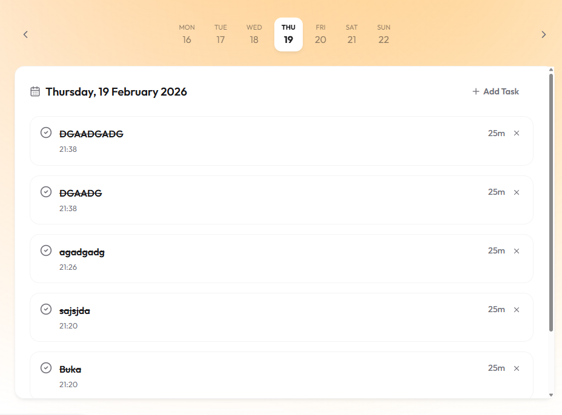

# 🍅 Pomodoro Calm

A beautiful, Apple-style Pomodoro timer application built with React, TypeScript, and Vite. Designed for focus and clarity.

**🚀 [Live Demo](https://pomodoro-calm.vercel.app/)**



## ✨ Features

- **Apple-Inspired Design**: Clean, modern aesthetics with glassmorphism, rounded corners, and smooth transitions.
- **Smart Timer**: Customizable focus sessions.
- **Weekly Stats**: Visualize your focus time with a dynamic weekly chart.
- **Task Management**:
  - Add, edit, and delete tasks.
  - Organize with **Priority** (Low, Medium, High) and **Category** (Work, Study, Personal) tags.
  - "Card-in-Card" layout for a clutter-free look.
- **Themes**: Seamless transition between **Light (Calm)** and **Dark (Focus)** modes with ambient glow effects.
- **Data Persistence**: Your tasks and stats are saved locally, so you pick up right where you left off.

## 🛠️ Tech Stack

- **Framework**: React + TypeScript
- **Build Tool**: Vite
- **Styling**: CSS Modules / Vanilla CSS with Variables
- **Icons**: Lucide React
- **Animations**: Framer Motion
- **State Management**: React Context API + useReducer
- **Date Handling**: date-fns

## 🚀 Getting Started

### Prerequisites

- Node.js (v16 or higher)
- npm or yarn

### Installation

1.  Clone the repository:
    ```bash
    git clone https://github.com/your-username/pomodoro-calm.git
    ```
2.  Navigate to the project directory:
    ```bash
    cd pomodoro-calm
    ```
3.  Install dependencies:
    ```bash
    npm install
    ```
4.  Start the development server:
    ```bash
    npm run dev
    ```

## 📸 Screenshots

*(Add your screenshots here)*

## 🤝 Contributing

Contributions are welcome! Feel free to submit a Pull Request.

## 📄 License

This project is open source and available under the [MIT License](LICENSE).
